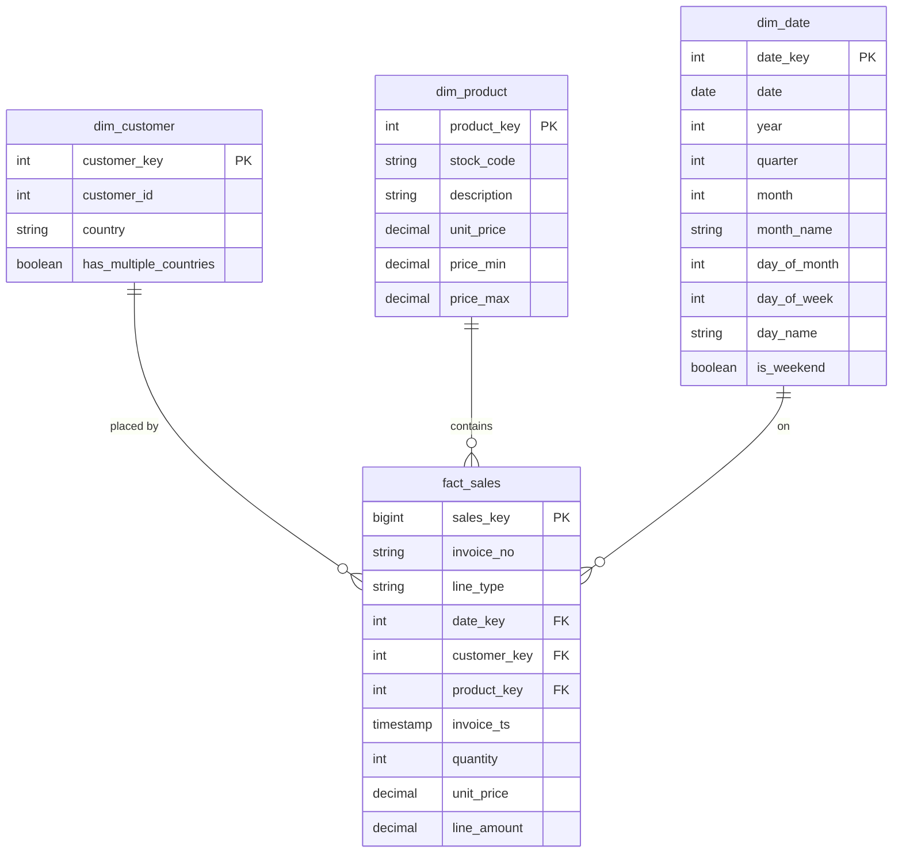

# Data model

The gold layer is a star schema with one fact table and three dimensions. It is built from the silver tables, after the cleaning described in `data_exploration.md`.

## Diagram

## Tables

### fact_sales

**Grain:** one row per order line, after exact duplicate rows are removed. 

| Column | Type | Description |
| --- | --- | --- |
| `sales_key` | bigint | Surrogate key. The source has no unique line id. |
| `invoice_no` | string | Degenerate dimension. Groups lines into an invoice. |
| `line_type` | string | `sale`, `cancellation` or `other`. See below. |
| `date_key` | int | FK to `dim_date`, `yyyymmdd`. |
| `customer_key` | int | FK to `dim_customer`. `-1` when the order has no customer. |
| `product_key` | int | FK to `dim_product`. |
| `invoice_ts` | timestamp | Invoice date and time. |
| `quantity` | int | Signed. Negative for cancellations and adjustments. |
| `unit_price` | decimal(10,2) | Price from `dim_product`, copied at load time. |
| `line_amount` | decimal(12,2) | `quantity * unit_price`. |

How `line_type` is set:

| line_type | Rule | Lines after dedup |
| --- | --- | ---: |
| `sale` | No prefix, quantity > 0 | 525,964 |
| `cancellation` | `InvoiceNo` starts with `C` | 9,177 |
| `other` | Everything else: negative quantity on a normal invoice, or an A invoice | 1,339 |

### dim_customer

**Grain:** one row per `CustomerID`, plus one `Unknown` row. 

| Column | Type | Description |
| --- | --- | --- |
| `customer_key` | int | Surrogate key. `-1` is the unknown customer. |
| `customer_id` | int | Natural key from the source. Null on the unknown row. |
| `country` | string | Cleaned country name. `Unknown` when not known. |
| `has_multiple_countries` | boolean | True for the 8 ids listed with two countries. |

### dim_product

**Grain:** one row per normalized stock code (`upper(trim(StockCode))`), plus one `Unknown` row. 

| Column | Type | Description |
| --- | --- | --- |
| `product_key` | int | Surrogate key. `-1` is the unknown product. |
| `stock_code` | string | Normalized stock code. |
| `description` | string | Product name. `Unknown` when there is no usable one. |
| `unit_price` | decimal(10,2) | Median of the non-zero prices for the code. |
| `price_min` | decimal(10,2) | Lowest non-zero price. |
| `price_max` | decimal(10,2) | Highest price. |

### dim_date

**Grain:** one row per calendar day, from 2010-12-01 to 2011-12-31.

| Column | Type | Description |
| --- | --- | --- |
| `date_key` | int | `yyyymmdd`, e.g. `20110105`. |
| `date` | date | Calendar date. |
| `year`, `quarter`, `month` | int | Calendar parts. |
| `month_name` | string | `January` to `December`. |
| `day_of_month` | int | 1 to 31. |
| `day_of_week` | int | 1 = Monday, 7 = Sunday (ISO). |
| `day_name` | string | `Monday` to `Sunday`. |
| `is_weekend` | boolean | Saturday or Sunday. |

## Key design decisions

1. **Star, not snowflake.** Country is a column on `dim_customer`, not its own table. It has only one attribute, so a separate table would just add a join.

2. **One fact table for every line type.** Sales, cancellations, adjustments and bad debt all go into `fact_sales`, labeled by `line_type`. Net revenue is `SUM(line_amount)`. Gross sales is the same sum filtered to `line_type = 'sale'`. A separate returns fact would mean a union for every net figure.

3. **One price per product.** `unit_price` is the median of the non-zero prices for each normalized stock code, rounded to 2 decimals. The median isn't pulled around by the odd very high or low price the way max or min is. `price_min` and `price_max` stay on the dimension so the range is visible. Three codes (`22196`, `22318`, `90168`) only have a zero price. They get a null `unit_price`, so their lines have a null `line_amount` instead of a fake zero.

4. **Price is copied onto the fact.** `fact_sales.unit_price` is set at load time, so revenue history doesn't change if the price rule changes later and the dimension is rebuilt.

5. **Unknown members instead of null keys.** About 25% of order lines have no `CustomerID`. They point to `customer_key = -1` and stay in the fact, so revenue totals are complete. `dim_product` has a `-1` row too, so a future unmatched code doesn't drop rows. Right now every order line matches a product.

6. **Customers with two countries.** The 8 ids with two countries get `country = 'Unknown'` and `has_multiple_countries = true`. Orders don't record a country, so choosing one would be a guess.

7. **Country cleanup.** `EIRE` becomes `Ireland`, `RSA` becomes `South Africa`, and `USA` becomes `United States`. `Unspecified` and `European Community` become `Unknown`. `Channel Islands` is kept as is.

8. **Stock code is normalized before anything else.** `upper(trim(StockCode))` is applied in silver, so 3,965 raw codes become 3,958. After that every order line joins to a product. Fee and postage codes (`POST`, `DOT`, `M`, ...) stay in `dim_product` as normal rows, so no order lines are lost.

9. **Description rule.** The description is the most frequent non-null one that has at least one capital letter (ties broken alphabetically). This drops warehouse notes like `damaged`, `check` and `ebay`, and keeps names like `Bank Charges`. Codes with nothing usable get `Unknown`.

10. **Dedup, then a surrogate key.** The 5,429 exact duplicate rows are removed in silver. After that, the same invoice and stock code still repeat 5,088 times with different quantities. Those look like real separate lines, so they are kept, and `sales_key` is the row identifier.

11. **Bad timestamps are fixed from the same invoice.** Every line on an invoice shares one timestamp. Invoice `540239` has 39 lines at `1/5/2011 14:48` and one at `15/5/2011 14:48`. Invoice `540798` has 76 lines at `12:11` and one at `12:90`. Both odd values are typos, so they take the timestamp from the rest of the invoice. This replaces the day-first reading in `data_exploration.md`.

12. **No time-of-day dimension.** Hours run from 6 to 20 and can be read straight from `invoice_ts`. A time dimension would add a table without adding anything new.

13. **Deterministic surrogate keys.** Keys are assigned with `row_number()` ordered by the natural key. Rerunning on the same input gives the same keys.

14. **Date range covers whole months.** `dim_date` runs to 2011-12-31 even though the data stops on 9 December. December 2011 is a partial month, and reports should say so.
